# 📘 BrightTech Blog

Spring Boot 4.x + Thymeleaf + PostgreSQL で作る、学習用の **テックブログシステム** です。
公開ブログの閲覧・カテゴリー別管理・管理者によるブログCRUDを備えています。

---

## 📑 目次

1. [システム概要](#1-システム概要)
2. [技術スタック](#2-技術スタック)
3. [作り方を学ぶには（learn フォルダ）](#3-作り方を学ぶには-learn-フォルダ)
4. [セットアップ・起動方法](#4-セットアップ起動方法)
5. [テーブル定義書](#5-テーブル定義書)
6. [ER図](#6-er図)
7. [フォルダ階層図](#7-フォルダ階層図)
8. [URLマッピング](#8-urlマッピング)
9. [シーケンス図（機能ごと）](#9-シーケンス図機能ごと)
10. [アクティビティ図（機能ごと）](#10-アクティビティ図機能ごと)

---

## 1. システム概要

**BrightTech Blog** は、フロントエンド・バックエンド・AI/ML・デザインなどテックカテゴリーのブログを発信・管理するための Web アプリです。

### 主な機能

| 区分           | 機能                                                                 |
| -------------- | -------------------------------------------------------------------- |
| 公開ページ     | ブログ一覧（ページング）／ブログ詳細                                 |
| 管理者認証     | 新規登録（サインアップ）／ログイン／ログアウト／プロフィール編集     |
| ブログ管理     | 新規登録／編集／削除／一覧表示                                       |
| カテゴリー管理 | 新規登録／編集／削除（使用中チェック付き）／一覧表示                 |

### 想定ユーザー

- **一般訪問者**：ログイン不要でブログを閲覧
- **管理者**：ログイン後、ブログ／カテゴリー／自身のプロフィールを管理

---

## 2. 技術スタック

### バックエンド

| カテゴリー       | 技術                       | バージョン         |
| ---------------- | -------------------------- | ------------------ |
| 言語             | Java                       | 17                 |
| フレームワーク   | Spring Boot                | 4.0.6              |
| Web              | Spring MVC                 | （Boot 同梱）      |
| データアクセス   | Spring Data JPA / Hibernate| （Boot 同梱）      |
| 認証・認可       | Spring Security 6.x        | （Boot 同梱）      |
| バリデーション   | Jakarta Bean Validation    | （Boot 同梱）      |
| 補助ライブラリ   | Lombok                     | 最新               |
| DB ドライバ      | PostgreSQL JDBC            | 最新               |

### フロントエンド（サーバーサイドレンダリング）

| カテゴリー       | 技術                                | 備考              |
| ---------------- | ----------------------------------- | ----------------- |
| テンプレート     | Thymeleaf                           | HTML5 ベース      |
| Security 連携    | thymeleaf-extras-springsecurity6    | CSRF / 認可表示   |
| CSS              | Tailwind CSS（CDN）                 | 学習用に CDN 経由 |

### データベース

| カテゴリー | 技術       | バージョン |
| ---------- | ---------- | ---------- |
| RDBMS      | PostgreSQL | 14+ 推奨   |

### ビルド・開発ツール

| カテゴリー    | 技術                | 備考                  |
| ------------- | ------------------- | --------------------- |
| ビルド        | Maven (mvnw)        | wrapper 同梱          |
| IDE 推奨      | Spring Tool Suite / IntelliJ IDEA / VS Code | Lombok プラグイン推奨 |

---

## 3. 作り方を学ぶには（learn フォルダ）

> 🎓 **本リポジトリは「学習用」です**。
> ソースを真似て書くだけでなく、**`learn/` フォルダの中の章立て資料** を読むことで、
> 「**なぜその順番で書くのか・各層の役割は何か・どこでよくつまづくのか**」を理解できます。

### learn フォルダの構成

```text
learn/
├── 第1章_Category_Entityを作る.md          ← 一番依存が薄い Entity から
├── 第2章_Blog_Entityを作る.md              ← @ManyToOne で関連を表す
├── 第3章_User_Entityを作る.md              ← パスワードの扱い／@Table の必要性
├── 第4章_Repositoryを作る.md               ← JpaRepository とメソッド名規約／ページング
├── 第5章_Formを作る.md                     ← 入力チェック ＋ Thymeleaf テンプレート同時作成
├── 第6章_Serviceを作る.md                  ← 業務ロジックの中心・トランザクション
├── 第7章_1_Controllerを作る.md             ← @GetMapping / @PostMapping / @Valid / PRG
└── 第7章_2_テンプレートとSecurityConfig.md ← 残りのテンプレート・認証・DB接続
```

### 各章で学べること

| 章 | 学べる主なテーマ                                                              |
| -: | ----------------------------------------------------------------------------- |
| 1  | `@Entity` / `@Table` / `@Id` / `@GeneratedValue` / `@Column` / `@PrePersist`  |
| 2  | `@ManyToOne` / `@JoinColumn` / `FetchType.LAZY` / N+1問題 / `TEXT` 型         |
| 3  | クラス名 ⇔ テーブル名のズレ／`UNIQUE` 制約／パスワードを生で保存しない原則    |
| 4  | `JpaRepository<E, ID>` / `findByXxx` メソッド名規約 / `Optional` / `Page`     |
| 5  | `@NotBlank` / `@NotNull` / `@Email` の使い分け／Entity ↔ Form の分離         |
| 6  | `@Service` / `@Transactional` / コンストラクタインジェクション／業務エラー   |
| 7-1| `@Controller` / `@Valid + BindingResult` / **PRG パターン**／フラッシュメッセージ |
| 7-2| `SecurityFilterChain` / email ログイン / CSRF / Lazy 例外対処                 |

### 推奨学習順序

```text
1章 → 2章 → 3章 → 4章 → 5章 → 6章 → 7-1章 → 7-2章
```

**「依存される側から先に作る」** が貫かれているので、上から順に読めば
コンパイルエラーやインポート不足で詰まりません。

---

## 4. セットアップ・起動方法

### 4-1. 前提環境

- Java 17 以上
- PostgreSQL 14 以上（ローカル or Docker）
- Maven（同梱の `mvnw` でOK）

### 4-2. データベース準備

```sql
CREATE DATABASE tech_blogs;
```

Docker で立てる例：

```bash
docker run -d --name pg \
  -e POSTGRES_PASSWORD=123456 \
  -p 5433:5432 \
  postgres:16
docker exec -it pg psql -U postgres -c "CREATE DATABASE tech_blogs;"
```

### 4-3. 接続情報を確認

`src/main/resources/application.properties` を環境に合わせて修正：

```properties
spring.datasource.url=jdbc:postgresql://localhost:5433/tech_blogs
spring.datasource.username=postgres
spring.datasource.password=123456
```

### 4-4. アプリ起動

```bash
# Windows
mvnw.cmd spring-boot:run

# Mac / Linux
./mvnw spring-boot:run
```

### 4-5. ブラウザでアクセス

| URL                                       | 内容                                |
| ----------------------------------------- | ----------------------------------- |
| http://localhost:8080/                    | リダイレクト → ブログ一覧            |
| http://localhost:8080/admin/register      | 管理者を新規登録（最初はここから）   |
| http://localhost:8080/login               | ログイン                            |
| http://localhost:8080/admin/blogs        | 管理画面（要ログイン）               |

---

## 5. テーブル定義書

### 5-1. テーブル一覧

| No | 論理名             | 物理名         | 用途                                       |
| --:| ------------------ | -------------- | ------------------------------------------ |
|  1 | 管理者テーブル     | `admin_users`  | 管理者ログイン・プロフィール管理           |
|  2 | カテゴリーテーブル | `categories`   | ブログのカテゴリー分類                     |
|  3 | ブログテーブル     | `blogs`        | ブログ記事（タイトル／本文／画像／公開日） |

### 5-2. `admin_users`（管理者）

| カラム名     | 型           | 桁数 | NOT NULL | PK | UNIQUE | 既定値              | 説明                              |
| ------------ | ------------ | ---:| :------: | :-:| :----: | ------------------- | --------------------------------- |
| `id`         | BIGSERIAL    |  -  |    ●     | ● |   -    | 自動採番            | 管理者ID                          |
| `name`       | VARCHAR      | 100 |    ●     | -  |   -    | -                   | 管理者の表示名                    |
| `email`      | VARCHAR      | 255 |    ●     | -  |   ●    | -                   | ログインID                        |
| `password`   | VARCHAR      | 255 |    ●     | -  |   -    | -                   | BCrypt ハッシュ済みパスワード     |
| `created_at` | TIMESTAMP    |  -  |    ●     | -  |   -    | CURRENT_TIMESTAMP   | 作成日時（自動）                  |
| `updated_at` | TIMESTAMP    |  -  |    ●     | -  |   -    | CURRENT_TIMESTAMP   | 更新日時（自動）                  |

### 5-3. `categories`（カテゴリー）

| カラム名     | 型           | 桁数 | NOT NULL | PK | UNIQUE | 既定値              | 説明                  |
| ------------ | ------------ | ---:| :------: | :-:| :----: | ------------------- | --------------------- |
| `id`         | BIGSERIAL    |  -  |    ●     | ● |   -    | 自動採番            | カテゴリーID          |
| `name`       | VARCHAR      | 100 |    ●     | -  |   ●    | -                   | カテゴリー名          |
| `created_at` | TIMESTAMP    |  -  |    ●     | -  |   -    | CURRENT_TIMESTAMP   | 作成日時              |
| `updated_at` | TIMESTAMP    |  -  |    ●     | -  |   -    | CURRENT_TIMESTAMP   | 更新日時              |

### 5-4. `blogs`（ブログ記事）

| カラム名       | 型         | 桁数 | NOT NULL | PK | FK              | 既定値              | 説明                            |
| -------------- | ---------- | ---:| :------: | :-:| --------------- | ------------------- | ------------------------------- |
| `id`           | BIGSERIAL  |  -  |    ●     | ● | -               | 自動採番            | ブログID                        |
| `title`        | VARCHAR    | 200 |    ●     | -  | -               | -                   | タイトル                        |
| `content`      | TEXT       |  -  |    ●     | -  | -               | -                   | 本文                            |
| `image_url`    | VARCHAR    | 500 |    -     | -  | -               | NULL                | アイキャッチ画像URL（任意）     |
| `category_id`  | BIGINT     |  -  |    ●     | -  | `categories(id)` | -                  | カテゴリー外部キー              |
| `published_at` | TIMESTAMP  |  -  |    ●     | -  | -               | CURRENT_TIMESTAMP   | 公開日時（画面で指定可能）      |
| `created_at`   | TIMESTAMP  |  -  |    ●     | -  | -               | CURRENT_TIMESTAMP   | 作成日時                        |
| `updated_at`   | TIMESTAMP  |  -  |    ●     | -  | -               | CURRENT_TIMESTAMP   | 更新日時                        |

---

## 6. ER図

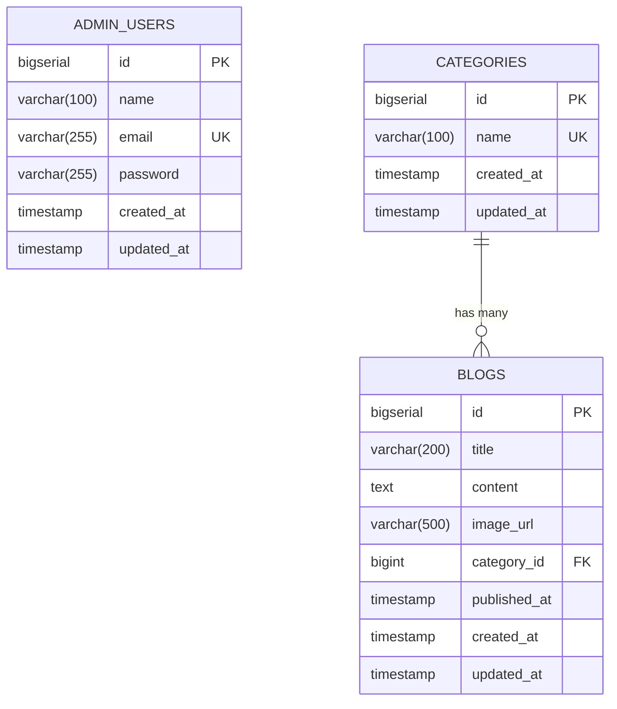

**関係性**

- `CATEGORIES (1) ─ (多) BLOGS` ：1つのカテゴリーが複数のブログを持つ
- `ADMIN_USERS` は他テーブルと FK 関係なし（独立）

---

## 7. フォルダ階層図

```text
TechBlog/
├── README.md                              ← このファイル
├── HELP.md                                ← Spring Boot 標準のヘルプ
├── pom.xml                                ← Maven 依存定義
├── mvnw, mvnw.cmd                         ← Maven Wrapper
│
├── learn/                                 ← 📘 章立て学習資料
│   ├── 第1章_Category_Entityを作る.md
│   ├── 第2章_Blog_Entityを作る.md
│   ├── 第3章_User_Entityを作る.md
│   ├── 第4章_Repositoryを作る.md
│   ├── 第5章_Formを作る.md
│   ├── 第6章_Serviceを作る.md
│   ├── 第7章_1_Controllerを作る.md
│   └── 第7章_2_テンプレートとSecurityConfig.md
│
├── src/main/java/com/meitaku/blog/
│   ├── TechBlogApplication.java           ← エントリーポイント
│   │
│   ├── config/
│   │   └── SecurityConfig.java            ← Spring Security 設定
│   │
│   ├── controller/                        ← Controller 層
│   │   ├── home/    HomeController.java
│   │   ├── blog/    BlogListController.java
│   │   │            BlogDetailController.java
│   │   │            BlogRegisterController.java
│   │   │            BlogEditController.java
│   │   │            BlogDeleteController.java
│   │   ├── auth/    LoginController.java
│   │   ├── user/    UserRegisterController.java
│   │   │            MyPageController.java
│   │   └── category/ AdminCategoryController.java
│   │
│   ├── service/                           ← Service 層（業務ロジック）
│   │   ├── CategoryService.java
│   │   ├── BlogService.java
│   │   └── UserService.java               (implements UserDetailsService)
│   │
│   ├── repository/                        ← Repository 層（DB操作）
│   │   ├── CategoryRepository.java
│   │   ├── BlogRepository.java
│   │   └── UserRepository.java
│   │
│   ├── entity/                            ← Entity 層（テーブル対応）
│   │   ├── Category.java
│   │   ├── Blog.java
│   │   └── User.java
│   │
│   ├── form/                              ← Form 層（画面入力）
│   │   ├── category/ CategoryForm.java
│   │   ├── blog/     BlogRegisterForm.java
│   │   │             BlogEditForm.java
│   │   └── user/     UserRegisterForm.java
│   │                 LoginForm.java
│   │
│   └── exception/
│       └── ResourceNotFoundException.java ← 404 用カスタム例外
│
└── src/main/resources/
    ├── application.properties             ← DB接続 / JPA / サーバー設定
    │
    └── templates/                         ← Thymeleaf テンプレート
        ├── fragments/layout.html          ← head / flash / globalErrors / fieldError
        ├── blog/
        │   ├── list.html                  ← 公開ブログ一覧
        │   └── detail.html                ← 公開ブログ詳細
        ├── auth/
        │   └── login.html                 ← ログイン
        ├── user/
        │   ├── register.html              ← 管理者新規登録
        │   └── profile.html               ← マイページ
        └── admin/
            ├── blog/
            │   ├── list.html              ← 管理ブログ一覧
            │   └── form.html              ← ブログ登録／編集
            └── category/
                ├── list.html              ← 管理カテゴリー一覧
                └── form.html              ← カテゴリー登録／編集
```

---

## 8. URLマッピング

### 8-1. 公開ページ（認証不要）

| メソッド | URL              | Controller              | メソッド          | 説明                       |
| -------- | ---------------- | ----------------------- | ----------------- | -------------------------- |
| GET      | `/`              | `HomeController`        | `index`           | `/blogs` へリダイレクト    |
| GET      | `/blogs`         | `BlogListController`    | `listForUser`     | 公開ブログ一覧（ページング）|
| GET      | `/blogs/{id}`    | `BlogDetailController`  | `detail`          | 公開ブログ詳細             |

### 8-2. 認証関連（認証不要）

| メソッド | URL                | Controller / 担当         | メソッド   | 説明                                  |
| -------- | ------------------ | ------------------------- | ---------- | ------------------------------------- |
| GET      | `/login`           | `LoginController`         | `showForm` | ログインフォーム表示                  |
| POST     | `/login`           | **Spring Security**       | -          | 認証処理（自作 Controller なし）      |
| POST     | `/logout`          | **Spring Security**       | -          | ログアウト処理（自作 Controller なし）|
| GET      | `/admin/register`  | `UserRegisterController`  | `showForm` | 管理者サインアップフォーム表示        |
| POST     | `/admin/register`  | `UserRegisterController`  | `register` | 管理者新規登録                        |

### 8-3. 管理画面：ブログ（`/admin/blogs/**`、認証必須）

| メソッド | URL                            | Controller                | メソッド        | 説明                  |
| -------- | ------------------------------ | ------------------------- | --------------- | --------------------- |
| GET      | `/admin/blogs`                 | `BlogListController`      | `listForAdmin`  | 管理ブログ一覧        |
| GET      | `/admin/blogs/new`             | `BlogRegisterController`  | `showForm`      | ブログ新規登録フォーム |
| POST     | `/admin/blogs`                 | `BlogRegisterController`  | `register`      | ブログ新規登録        |
| GET      | `/admin/blogs/{id}/edit`       | `BlogEditController`      | `showForm`      | ブログ編集フォーム    |
| POST     | `/admin/blogs/{id}/edit`       | `BlogEditController`      | `update`        | ブログ更新            |
| POST     | `/admin/blogs/{id}/delete`     | `BlogDeleteController`    | `delete`        | ブログ削除            |

### 8-4. 管理画面：カテゴリー（`/admin/categories/**`、認証必須）

| メソッド | URL                                    | Controller                   | メソッド            | 説明                  |
| -------- | -------------------------------------- | ---------------------------- | ------------------- | --------------------- |
| GET      | `/admin/categories`                    | `AdminCategoryController`    | `list`              | カテゴリー一覧        |
| GET      | `/admin/categories/new`                | `AdminCategoryController`    | `showRegisterForm`  | 新規登録フォーム      |
| POST     | `/admin/categories`                    | `AdminCategoryController`    | `register`          | 新規登録              |
| GET      | `/admin/categories/{id}/edit`          | `AdminCategoryController`    | `showEditForm`      | 編集フォーム          |
| POST     | `/admin/categories/{id}/edit`          | `AdminCategoryController`    | `update`            | 更新                  |
| POST     | `/admin/categories/{id}/delete`        | `AdminCategoryController`    | `delete`            | 削除（使用中チェック）|

### 8-5. 管理画面：プロフィール（認証必須）

| メソッド | URL              | Controller         | メソッド   | 説明                      |
| -------- | ---------------- | ------------------ | ---------- | ------------------------- |
| GET      | `/admin/profile` | `MyPageController` | `showForm` | 自身のプロフィール表示    |
| POST     | `/admin/profile` | `MyPageController` | `update`   | 自身のプロフィール更新    |

---

## 9. シーケンス図（機能ごと）

### 9-1. 公開ブログ閲覧（一覧）

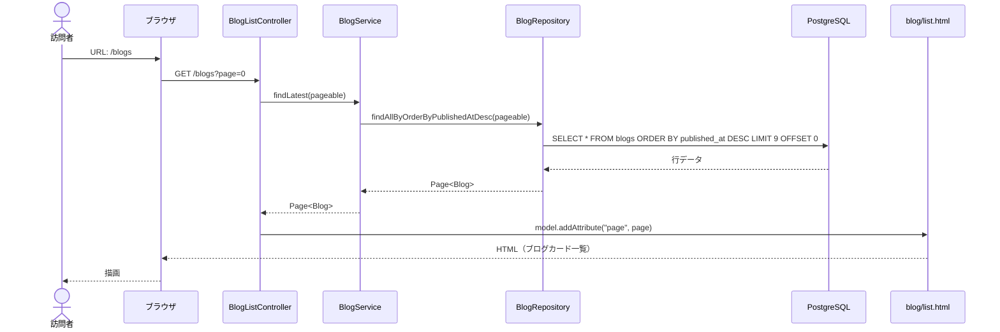

### 9-2. 公開ブログ詳細

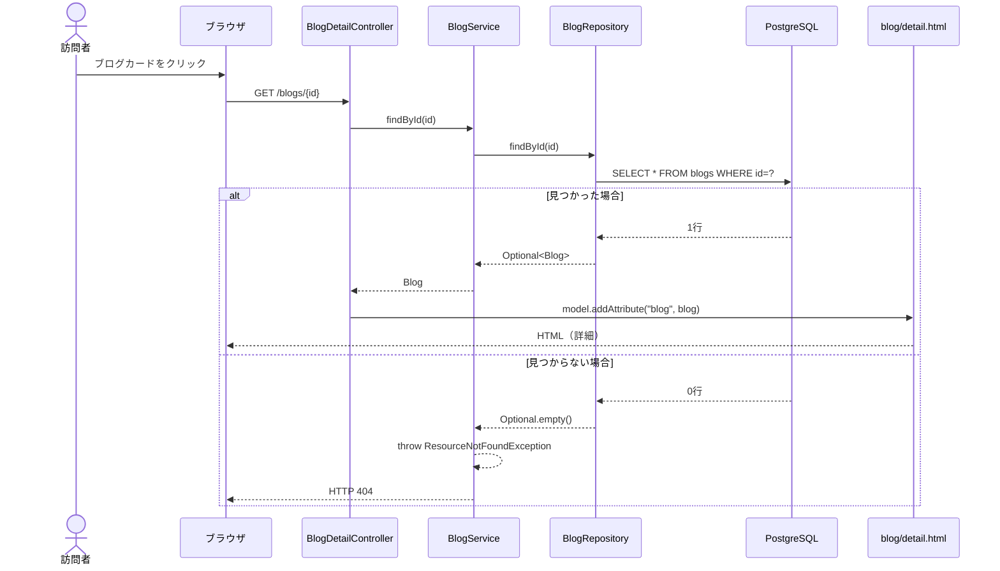

### 9-3. 管理者ログイン

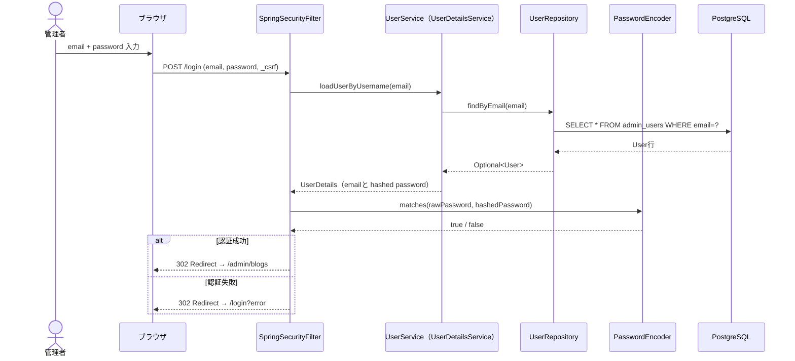

### 9-4. ブログ新規登録

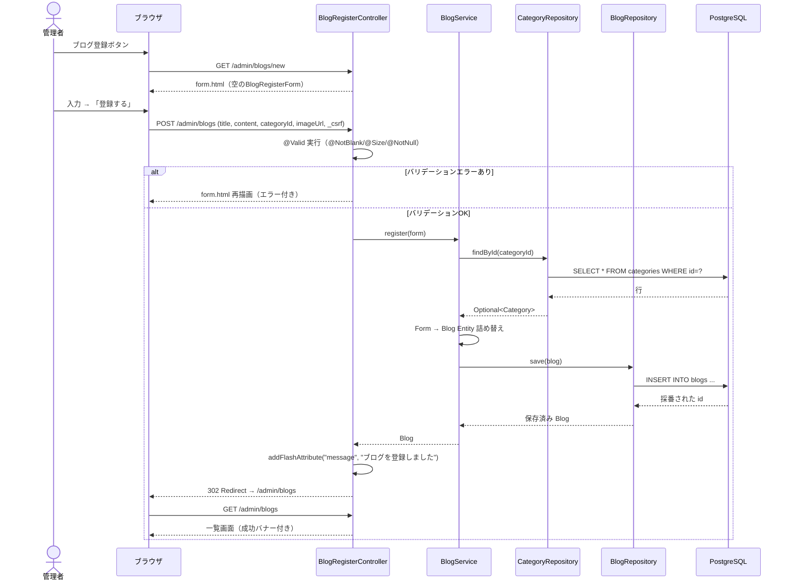

### 9-5. ブログ削除

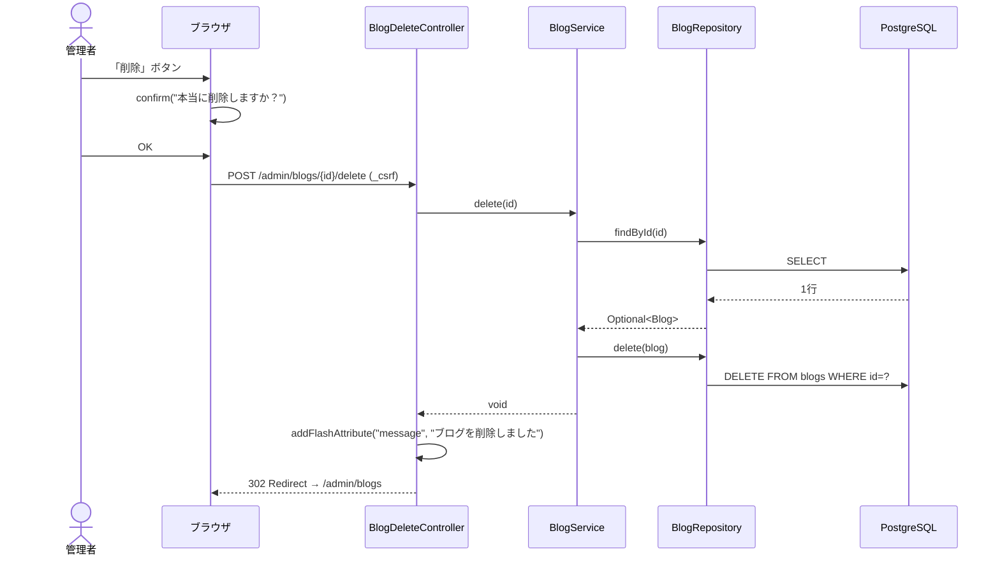

### 9-6. カテゴリー削除（使用中チェックあり）

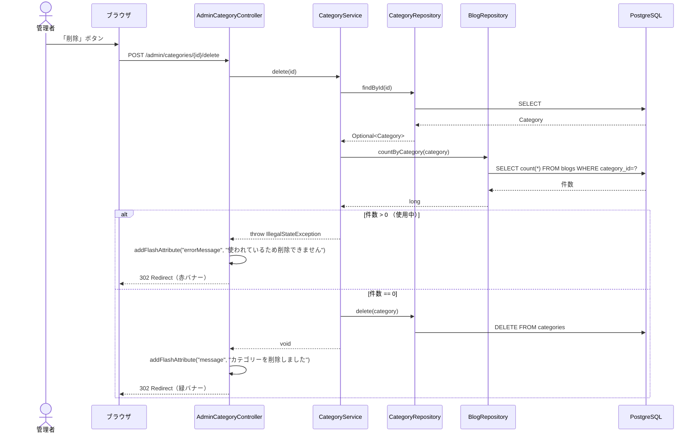

### 9-7. 管理者新規登録（サインアップ）

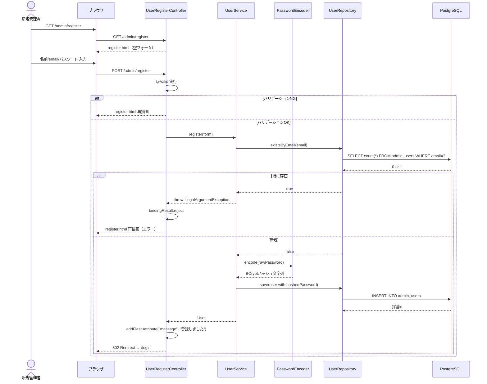

### 9-8. プロフィール更新

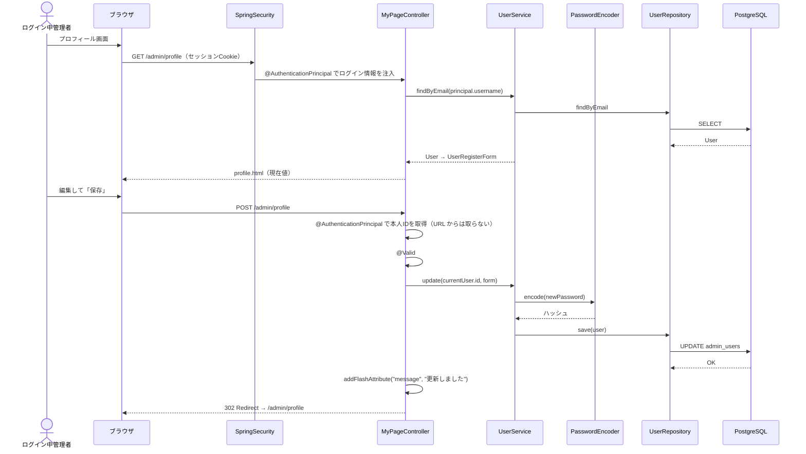

---

## 10. アクティビティ図（機能ごと）

### 10-1. 公開ブログ閲覧（一覧）

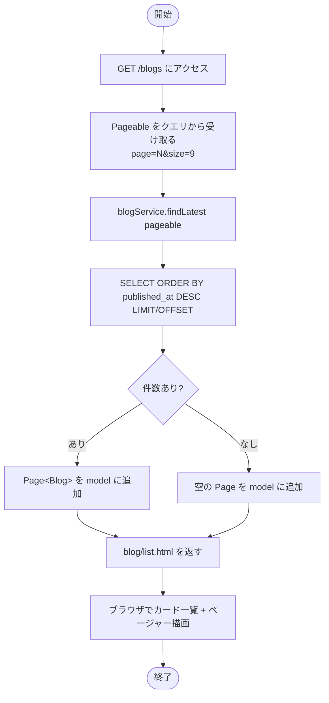

### 10-2. ブログ詳細

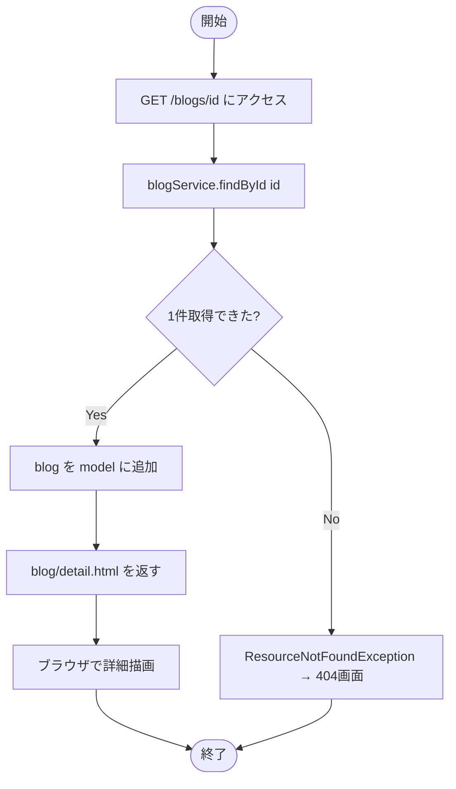

### 10-3. 管理者ログイン

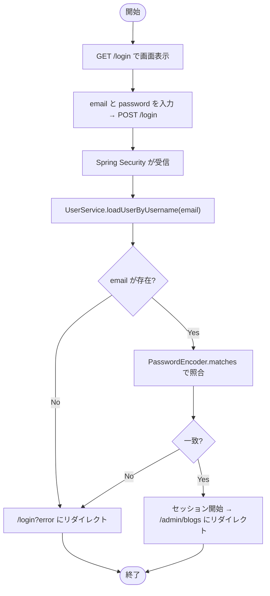

### 10-4. ブログ新規登録

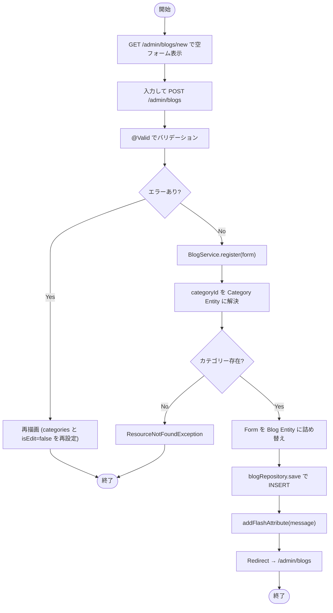

### 10-5. ブログ編集

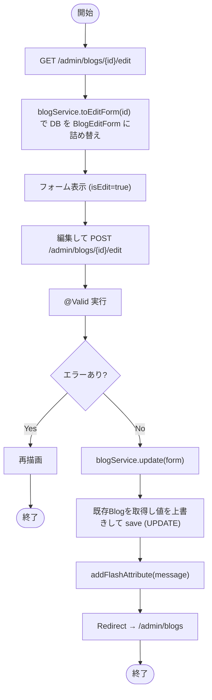

### 10-6. ブログ削除

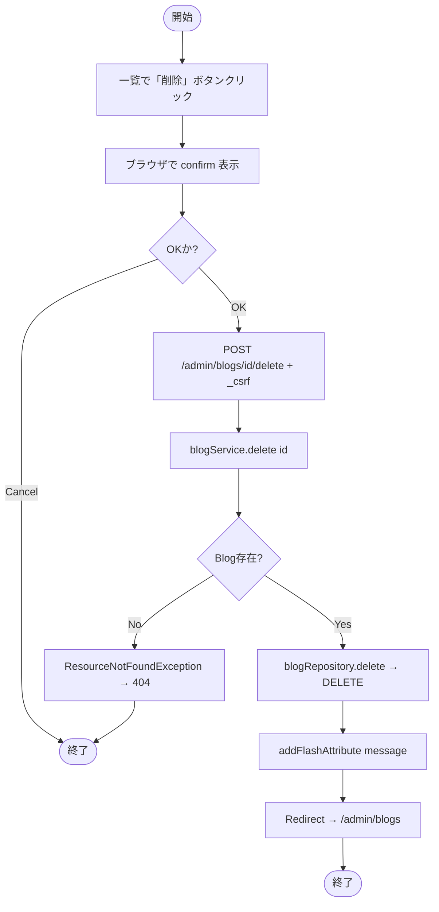

### 10-7. カテゴリー削除（使用中チェック）

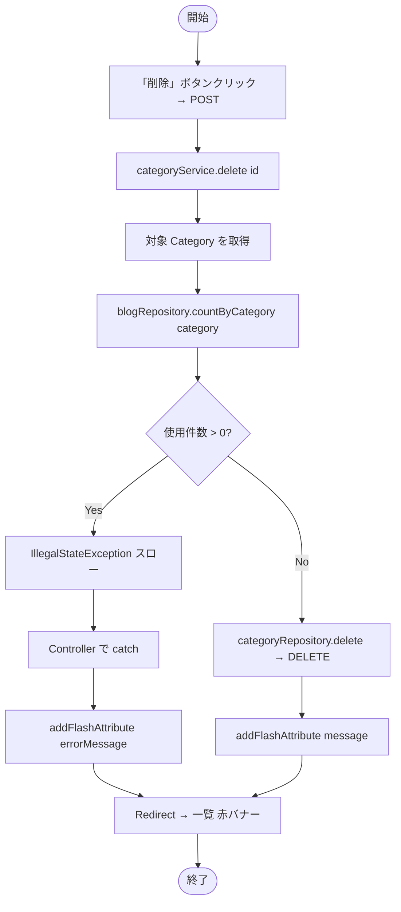

### 10-8. 管理者新規登録

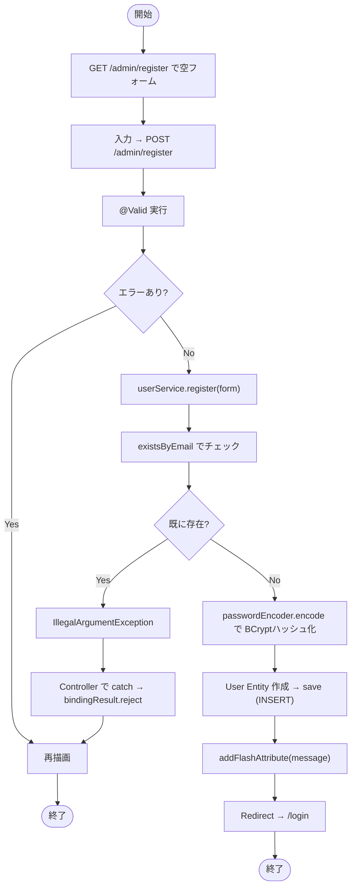

### 10-9. プロフィール更新

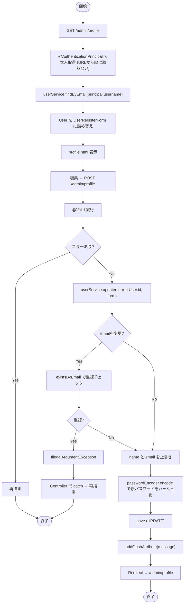

---

## 🎉 おわりに

このシステムは **学習用** に作られており、`learn/` フォルダの章立て資料と合わせて読むことで、
**Spring Boot による典型的な3層アーキテクチャ** + **Thymeleaf** + **Spring Security** の
基本パターンを一通り体験できます。

ここから先のステップ（応用編）：

- 単体テスト・統合テスト（`@DataJpaTest` / `@WebMvcTest` / `@SpringBootTest`）
- DBマイグレーション（Flyway / Liquibase）
- 画像アップロード（`MultipartFile`）
- ロール分割（`ROLE_ADMIN` / `ROLE_EDITOR`）
- CI/CD（GitHub Actions）

お疲れさまでした 🎉
